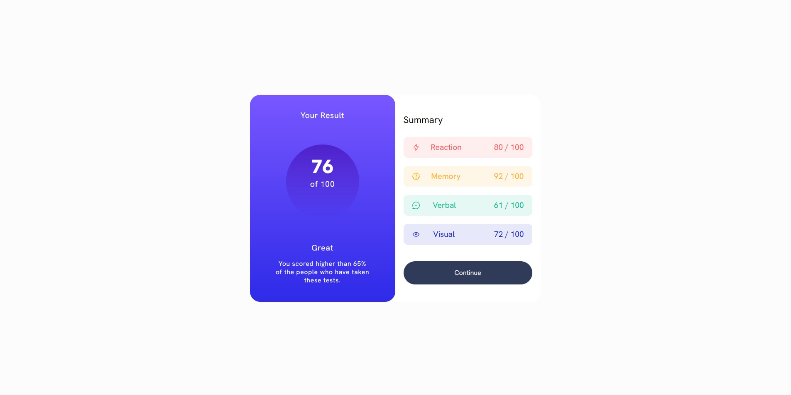

# Frontend Mentor - Results summary component solution

This is a solution to the [Results summary component challenge on Frontend Mentor](https://www.frontendmentor.io/challenges/results-summary-component-CE_K6s0maV). Frontend Mentor challenges help you improve your coding skills by building realistic projects.

## Table of contents

- [Overview](#overview)
  - [The challenge](#the-challenge)
  - [Screenshot](#screenshot)
  - [Links](#links)
- [My process](#my-process)
  - [Built with](#built-with)
  - [Useful resources](#useful-resources)

## Overview

### The challenge

Users should be able to:

- View the optimal layout for the interface depending on their device's screen size
- See hover and focus states for all interactive elements on the page

### Screenshot

### Links

- Solution URL: [Add solution URL here](https://github.com/apurva-7/results-summary-component-main)
- Live Site URL: [Add live site URL here](https://apurva-7.github.io/results-summary-component-main/)

## My process

- Started with a mobile first approach and further used media quries to make responsive to desktop suitable.

### Built with

- Semantic HTML5 markup
- CSS custom properties
- Flexbox
- CSS Grid
- Mobile-first workflow

### Useful resources

- (https://stackoverflow.com/) - Godsend on finding quirky ideas
- (https://yoksel.github.io/flex-cheatsheet/) - Always a backup to remember flexbox in an interactive way.
- (https://developer.mozilla.org/en-US/) - Great documentation
- (https://www.udemy.com/course/the-web-developer-bootcamp/) - Amazing and extensive course on html and css.
